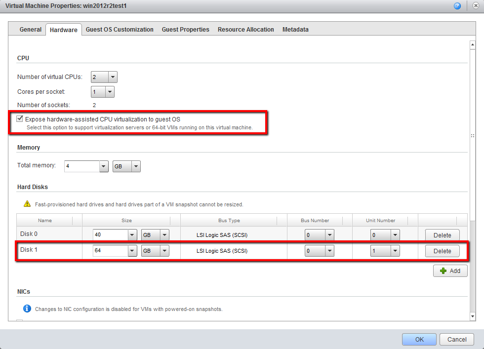

# basebox-slave

Setup a Windows Jenkins slave to build baseboxes with packer.
This slave is used to build 64bit baseboxes as well.

## Environment
An vApp with a Windows 2012 R2 will be fine.
* The VM must have **Expose hardware-assisted CPU virtualization to guest OS** enabled. Go into properties of VM and open the hardware tab and enable the checkbox
* The VM must have a **second hard drive D: with plenty of disk space** to build boxes on it. Go into properties of VM and open the hardware tab and add a second hard disk with 64 GByte.
* Boot the VM, open the Computer Management, remove or move the DVD drive to another drive label than D:, initialize second hard disk as drive D:



## Directories
* PACKER_CACHE_DIR D:\Packer\cache
* PACKER_TEMP_DIR D:\Packer\temp
* VirtualBox D:\VirtualBox

## Installation
To install it in the preinstalled machine, you must have at least powershell installed.

Open up a command prompt by typing **Windows+R** and enter **cmd** and press enter.
Then enter following command:

```bash
powershell -NoProfile -ExecutionPolicy unrestricted -Command "((new-object net.webclient).DownloadFile(' https://raw.github.com/StefanScherer/basebox-slave/master/install.bat', '%Temp%\install.bat'))" && %Temp%\install.bat
```

Afterwards you have VirtualBox 4.3.6 and Packer 0.5.1 installed and in PATH.

### Installed Software
These software will be installed

* Chocolatey package manager
* Firefox 27
* Git 1.8.5 commandline
* Packer 0.5.1
* VMware PowerCLI 5.5
* VMware Workstation 10
* Vagrant 1.4.3
* Vim 7.4
* VirtualBox 4.3.6
* wget
* ovftool (part of VMware Workstation)

# Jenkins

Set up your host, install node and grunt:

```
brew update
brew install node
npm install -g grunt-cli
```

## Manage Jenkins configuration
After each time you made changes to the global Jenkins configuration, plugins
or jobs just do:

```
grunt jenkins-backup
```

This will backup all stuff to the jenkins-configuration folder. You may put it
under version control, yay!

You can install jenkins configuration using:

```
grunt jenkins-install
```

When you added / removed plugins you must restart Jenkins:

```
open http://10.100.50.4:2200/safeRestart
```

## View Jenkins Web Interface
If you just want to view into Jenkins use this command:

```
open http://10.100.50.4:2200/
```     

# Licensing
Copyright (c) 2014 Stefan Scherer

MIT License, see LICENSE for more details.
    
