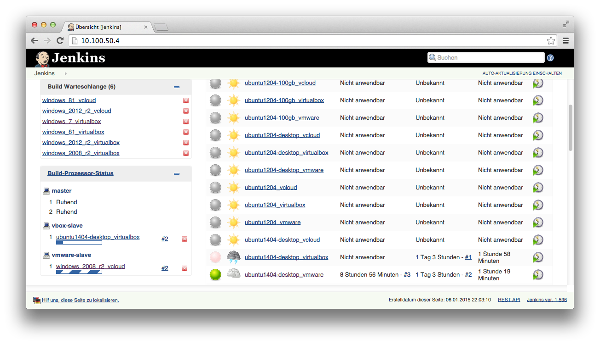

# basebox-slave

This is my work in progress to setup a build environment to build baseboxes for VMware vCloud
to be used with Vagrant and the vagrant-vcloud plugin.
The basebox build environment itself can be built with the same tools and created inside the vCloud, eating and creating its own dogfood.


## Installation
On your host machine you will need the following tools installed:

* Vagrant 1.6.3
* vagrant-vcloud plugin 0.4.0 with the command `vagrant plugin install vagrant-vcloud`
* Your vCloud access informations in your global `~/.vagrant.d/Vagrantfile`

After that you should clone this repo and have some customizations. See below for more details.

## Create the basebox builder

Now you can build the vApp 'the Vagrant way':

```bash
vagrant up --provider=vcloud
```

This will spin up an vApp with two VMs:

### basebox-jenkins
The `basebox-jenkins` VM is an Ubuntu server with a Jenkins server installed. This server has the IP address `176.16.32.2` and the HTTP port of Jenkins web interface listens on port 80.
A port forwarding is done even through your vCloud edge gateway if you have to use it.

Check out for the forwarded port while spinning up the vApp, or check it later with

```bash
vagrant vcloud -n
```

So you can retrieve the correct IP address and port number to access the Jenkins web interface from your host machine.

You can login to your jenkins server with just the following command:

```bash
vagrant ssh basebox-jenkins
```

### basebox-slave
The `basebox-slave` VM is a Windows machine (I use a windows_2008_r2). This machine has the IP address `176.16.32.3` and has RDP, SSH and WinRM ports open.

You can login to your jenkins slave with RDP with the following command:

```bash
vagrant rdp basebox-slave
```

Notice: Windows host users need Vagrant 1.6.4 or at least a patch for the bug in Vagrant 1.6.3 to make `vagrant rdp` work. There is a problem writing the rdp file for mstsc at the moment.

After creating the basebox-slave VM you have to licsense the installed VMware Workstation manually. I have added a command in the `./scripts/provision-basebox-slave.bat` script to directly enter the VMware license, but I cannot put that into the repo.

This is a good situation to test the `vagrant rdp basebox-slave` which works nice.

The software installed in the basebox-slave is:

* Chocolatey - package like installations on Windows
* packer 0.6.0
* packer-post-processor-vagrant-vmware-ovf 0.1.2
* VMWare Workstation 10
* msysgit
* wget

## Customization
As I have started the project much smaller with simple shell provisioning scripts, it still has its roots in plain shell scripts. Perhaps in the future there will be some higher level solution with Chef, Puppet, Ansible, ...

### Choose the baseboxes
In the `Vagrantfile` you may adjust the boxes and box_urls used for the two VMs.
As I cannot make the Windows VM public, I will change at least the box_url of the Ubuntu VM to one pointing to the vagrantcloud soon.

### Mail Server for Jenkins mails
Edit the file `./scripts/install-jenkins-server.sh` to change the `smtpHost`

### Download URL for VMware Workstation
As VMware Workstation is not available with a anonymous download, you have to customize the download link into your intranet in the script `./scripts/provision-basebox-slave.bat`


## Jenkins

I use `grunt-jenkins` to customize and backup the Jenkins configuration. So my Jenkins box is only a throw away product to be set up again with Jenkins job configurations from source control.

My current Jenkins jobs are stored in this repo as well in the directory `jenkins-configuration`.

### Install grunt
On your host machine, you will need node, npm and grunt:

```
brew update
brew install node
npm install -g grunt-cli
```

### Install grunt-jenkins
On you host machine, you have to call 

```
npm install
```

to install grunt-jenkins and other Node dependencies.


### Customize Jenkins URL
In the `Gruntfile.js` you have to enter the Jenkins IP address and port to connect from your host to the Jenkins VM.

In my case this is `10.100.50.4:2200` as you can see in the Gruntfile.js.

You also need a patch for grunt-jenkins


### Install Jenkins jobs

You can install my prebuilt Jenkins job configuration using:

```
grunt jenkins-install
```

When you added / removed plugins you must restart Jenkins:

```
open http://10.100.50.4:2200/safeRestart
```

Have a look at the Jenkins jobs, there you can see how I build the baseboxes and from with GitHub Repos they come from. See below for more details.

### Manage Jenkins configuration
After each time you made changes to the global Jenkins configuration, plugins
or jobs just do:

```
grunt jenkins-backup
git add jenkins-configuration
git commit
```

This will backup all stuff to the jenkins-configuration folder. You may put it
under version control, yay!

So the whole Jenkins server could be destroyed and rebuilt with another `vagrant up --provider=vcloud`.

## View Jenkins Web Interface
If you just want to view into Jenkins use this command:

```
open http://10.100.50.4:2200/
```     



You also can see the automatically added Jenkins node `basebox-slave` in the list of nodes:


# Licensing
Copyright (c) 2014 Stefan Scherer

MIT License, see LICENSE for more details.
    
